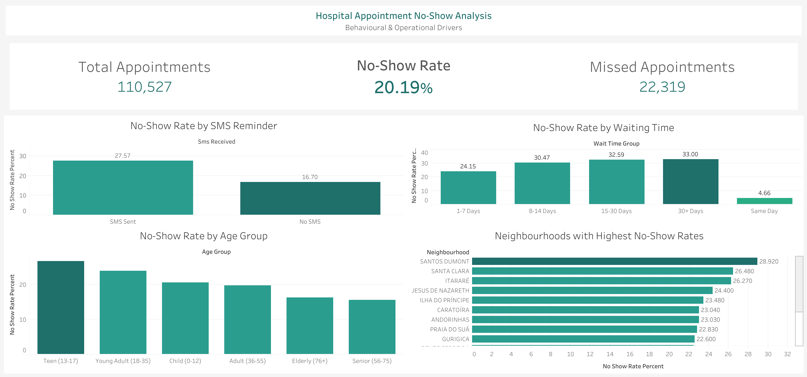

# Healthcare Appointment No-Show Analysis

## Project Overview

Missed medical appointments create operational inefficiencies, increase costs, and reduce quality of care. This project analyzes hospital appointment no-show patterns to identify **behavioral, demographic, and operational drivers** of missed appointments and provide **actionable recommendations** for healthcare administrators.

The analysis focuses on understanding **who is most likely to miss appointments and why**, using Python for data preparation, SQL for analysis, and Tableau for visualization.

---

## Business Questions

* What is the overall no-show rate and scale of missed appointments?
* Do SMS reminders reduce appointment no-shows?
* How does waiting time between scheduling and appointment affect attendance?
* Are certain age groups more likely to miss appointments?
* Do no-show rates vary significantly by neighbourhood?

---

## Dataset

**Medical Appointment No-Shows (Kaggle)**

* ~110,000 appointment records
* Public healthcare appointment data
* Includes demographics, scheduling details, health indicators, and attendance outcomes

---

## Tools & Skills Used

### Python (Data Cleaning & Feature Engineering)

* Pandas
* Datetime parsing & validation
* Feature engineering:

  * Waiting days
  * Appointment weekday
  * Appointment month
  * Age groups
  * Wait time buckets
  * Has disability flag
  * No-show flag
  * High-risk no-show indicator
* Data sanity checks & exploratory analysis

### SQL (MySQL – Analysis Layer)

* Table creation & CSV ingestion via terminal
* Aggregations and KPIs
* Views for reusable analysis:
  * No-show rates by SMS
  * No-show rates by waiting time
  * No-show ratesby age group
  * No-show ratesby neighbourhood
* Business-focused metrics for dashboarding

### Tableau (Visualization & Storytelling)

* KPI cards (Total appointments, missed appointments, no-show rate)
* Bar charts for behavioral and demographic drivers
* Clean, executive-style dashboard design
* Insight-driven captions

---

## Key Insights

* **Overall no-show rate:** ~20% of appointments are missed
* **Waiting time is a major driver:** Longer lead times significantly increase no-show likelihood
* **SMS reminders:** Higher no-show rates among SMS recipients suggest reminders may be targeted to high-risk patients rather than preventing no-shows
* **Age patterns:** Younger patients show higher no-show rates than older groups
* **Geographic variation:** Certain neighbourhoods consistently experience higher no-show rates

---

## Recommendations

* Reduce appointment lead times where possible to improve attendance
* Re-evaluate SMS reminder strategy (timing, content, targeting)
* Implement targeted interventions for high-risk neighbourhoods
* Consider overbooking or reminder escalation for high-risk patient segments

---

## Repository Structure

```
Healthcare-No-Shows-Analysis/
│
├── assets/
│   ├── No-Shows-Dashboard.png
│   ├── v_high_risk_no_shows.csv
│   ├── vw_age_group_no_shows.csv
│   ├── vw_neighbourhood_no_shows.csv
│   ├── vw_overall_no_shows.csv
│   ├── vw_sms_no_shows.csv
│   └── vw_wait_time_no_shows.csv
│
├── data/
│   ├── cleaned/          
│       ├── Medical-Noshows-May-2016-Cleaned.csv      # Cleaned CSV used for SQL & Tableau
│   └── raw/              
│       ├── Medical-Noshows-May-2016.csv              # Original dataset
│
├── python/
│   └── Healthcare No Shows Cleaning.ipynb
│
├── report/
│   └── Healthcare No-Show Analytics Project.docx
│
├── sql/
│   └── Healthcare No-Shows Analysis.sql
│
├── tableau/
│   └── Healthcare No Shows Tableau.twbx
│
└── README.md
```

---

## Dashboard Preview

### Business Performance Overview


---

## Deliverables

* Some of the assets created in the process of analysis: [assets](assets)
* Raw and clean data: [data](data)
* Data Cleaning Process using Python: [python](python)
* Project Report: [report](report)
* EDA done inside MySQL Workbench: [sql](sql)
* Visualizations done using Tableau Public: [tableau](tableau)

---

## Portfolio Value

This project demonstrates the ability to:

* Work with large, messy, real-world healthcare data
* Translate business problems into analytical questions
* Perform end-to-end analytics using Python, SQL, and Tableau
* Communicate insights clearly to non-technical stakeholders

---

## Tableau Dashboard

*((https://public.tableau.com/app/profile/ibrahim.gritly/viz/HealthcareNoShowsTableau/Dashboard1?publish=yes))*

---

## Author

**Ibrahim M. Hassan**
Data Analytics Portfolio Project
